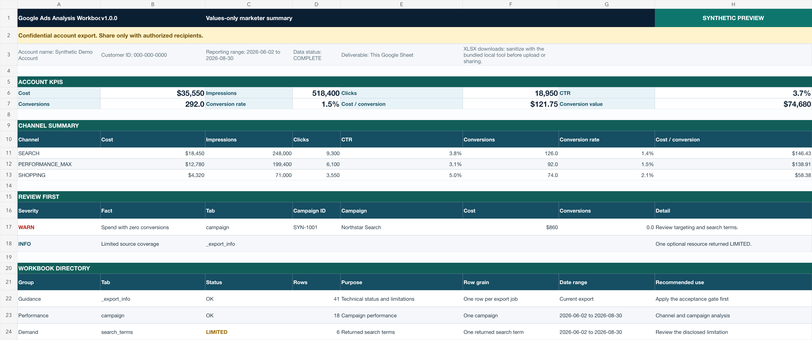

# Google Ads Analysis Workbook

**Your Google Ads account, packaged for analysis.**

Google Ads Analysis Workbook turns one individual advertiser account into a
validated, self-describing Google Sheet structured for authorized human or
LLM-assisted analysis. The exporter is read-only with respect to Google Ads
and writes its output and resumable checkpoints to the configured Google
Sheet.

It runs inside Google Ads Scripts without separately provisioning a Google
Ads API developer token, OAuth client, Google Cloud project, paid connector,
or MCP server. Google authorization is still required for the advertiser
account and destination Sheet.

_Synthetic preview of the exporter-generated START_HERE layout. All account
names, customer and campaign identifiers, dates, and metrics shown above are
fictional. Technical readiness never grants sharing permission._

## Why it exists

The project is for marketers and analysts who need a portable, documented
account-context package for review, handoff, or controlled analysis but cannot
or do not want to provision a direct API integration, data warehouse, paid
reporting connector, or direct chatbot integration.

Instead of asking the user or an LLM to infer what a collection of unrelated
exports means, the workbook includes navigation, completion status, row counts,
row grain, keys, source fields, units, derivations, blank-value meaning, and
known limitations.

## What it does

- Packages selected Google-returned performance and account context into a
  native, multi-tab Google Sheet.
- Covers campaign and ad-group performance, weekly trends, account structure,
  keywords, search terms, ads, landing pages, geography, proximity, negative
  keyword scopes, audience performance and signals, conversion configuration,
  assets, Quality Score, and recent change context.
- Uses exactly 90 complete performance days ending yesterday. Weekly outputs
  use the same boundaries. Change history deliberately uses 28 complete days.
  Structure and configuration tabs are point-in-time reads taken during the
  export.
- Resumes from durable workbook checkpoints when Google Ads Scripts approaches
  its execution limit. The default checkpoint window is 24 hours from the
  original start time.
- Includes `START_HERE`, `_export_info`, `_data_dictionary`, and
  `_field_dictionary` so people and analysis tools can interpret the workbook.
- Applies an explicit technical readiness gate before identifying a workbook as
  ready.
- Keeps the native Google Sheet as the primary deliverable.
- Includes an optional local Node.js tool that corrects converter-created XLSX
  hyperlinks after the user manually downloads the completed Sheet.

## What “validated” means

Before `_export_info.workbook_status` becomes `READY` or
`READY_WITH_LIMITATIONS`, the exporter checks the account identity, reporting
ranges, expected tab set, schemas, declared and physical row counts, workbook
status consistency, temporary-tab cleanup, and workbook grid limits.

Validation does not mean Google returned every possible record. It does not
remove the disclosed limitations of Google Ads reporting, make sequential tab
reads atomic, or decide whether the advertiser authorizes external sharing.

## What this does not do

- It is not an editable Google Ads account backup and cannot be imported to
  restore an account.
- It is not an MCC or multi-account exporter. It processes one individual
  advertiser account at a time.
- It is not a real-time dashboard, recurring connector, continuous sync, or
  atomic account snapshot.
- It is not an automated optimizer and does not apply campaign, budget, bid,
  targeting, creative, or conversion changes.
- It is not an exhaustive export of every Google Ads resource, field, or
  record. Campaign type, account eligibility, privacy thresholds, zero-activity
  filtering, and Google Ads resource support affect returned coverage.
- It does not connect directly to an LLM or upload the workbook to an AI
  service.
- It does not automatically create or distribute XLSX files.
- It does not anonymize, redact, de-identify, or authorize sharing of any
  output.

Audience outputs contain returned Performance Max signals and user-list
performance, not complete audience inventory. Change history defaults to
Google Ads web-client changes, excludes sensitive actor and old/new value
details, and can be limited by Google's paging rules.

## Install and run

Run this version only from the individual advertiser account whose data you
want to export. Never run it from a Google Ads manager account (MCC). If you
access the advertiser through a manager account, switch into the client
advertiser account first.

You need permission to run Google Ads Scripts in that advertiser account and
permission to edit a blank Google Sheet dedicated to the export. For the full
copy-and-paste workflow, see [Quickstart](docs/QUICKSTART.md).

1. Create a blank Google Sheet and copy its URL into `CONFIG.SPREADSHEET_URL`
   in `google-ads-analysis-workbook.js`.
2. In Google Ads Scripts, create a script, paste the exporter, save, and use
   **Preview** first. Preview runs read-only compatibility diagnostics; it does
   not create the final workbook.
3. Proceed to **Run** only when Preview reaches `Diagnostics complete`, reports
   `native_sheet_target: SUPPORTED`, and the selected advertiser is correct.
   `SUPPORTED; rows_read=0` is normal and means that no matching row was found.
   Stop on an earlier Preview error. Review any `UNSUPPORTED_OR_ERROR`: an
   optional resource can become `LIMITED`, while a required export job can
   still block final readiness.
4. Use **Run** to start the export. If it pauses with a resumable status, run
   it again within the 24-hour checkpoint window without editing, renaming, or
   deleting exporter-owned tabs.
5. Apply the `_export_info` acceptance gate below before relying on the output.

## `_export_info` acceptance gate

Treat `_export_info.workbook_status` as the primary technical go/no-go field and
follow `_export_info.next_action`:

- `READY`: the workbook passed the exporter's technical completion checks and
  is available for authorized use, analysis, or download.
- `READY_WITH_LIMITATIONS`: use it only after you review every `LIMITED` row and
  decide that each limitation is acceptable for the intended analysis.
- `IN_PROGRESS`: do not analyze, download, or share the workbook. Follow
  `next_action` to resume it.
- `NEEDS_REVIEW`: do not analyze, use, download, or share the workbook. Review
  `overall_status`, every error or preserved-data row, and `next_action`.

`COMPLETE_WITH_ERRORS` maps to `NEEDS_REVIEW`; it is not a successful export.
Any `overall_status` other than `COMPLETE` or `COMPLETE_WITH_LIMITATIONS` is not
acceptable for analysis. In all cases, follow the exact
`_export_info.next_action` value.

`READY` is a technical status. It does not grant permission to share or upload
the workbook. Advertiser authorization, organizational policy, and the
receiving provider's terms still control that decision.

If you need an XLSX copy, download the completed native Sheet yourself and run
the optional sanitizer locally. The sanitizer checks the OOXML package and
removes unintended converter-created hyperlinks; it does not create a
shareable or anonymized workbook.

## Limits and confidentiality

Tabs are sequential query snapshots, so values can have small freshness
differences while an export is running. Attribution adjustments and invalid
traffic adjustments can also change reported values later.

Google Ads can omit some low-volume search terms for privacy. Google Ads
Scripts and Google Sheets have execution-time and cell limits, so a large
export can require more than one manually started run. Asset-level metrics can
be segmented and are not always additive. Account-level negative keyword
lists, shared-list negatives, campaign negatives, and ad-group negatives are
different scopes.

The Sheet and any downloaded or sanitized XLSX contain confidential advertiser
information. Use them only with advertiser authorization and under your
organization's data policy. Read [Data handling](DATA-HANDLING.md) before
sharing or uploading an output to another service.

## Help and project policies

- [Quickstart](docs/QUICKSTART.md)
- [Testing](docs/TESTING.md)
- [Maintainer release procedure](docs/RELEASING.md)
- [Support](SUPPORT.md)
- [Security reporting](SECURITY.md)
- [Contributing](CONTRIBUTING.md)
- [Changelog](CHANGELOG.md)
- [Canonical repository](https://github.com/wvuhskr/google-ads-analysis-workbook)

Licensed under the [MIT License](LICENSE).

This independent project is not affiliated with or endorsed by Google.
